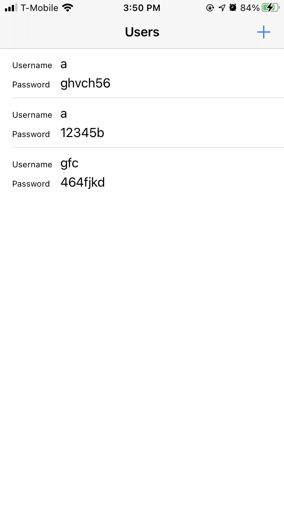
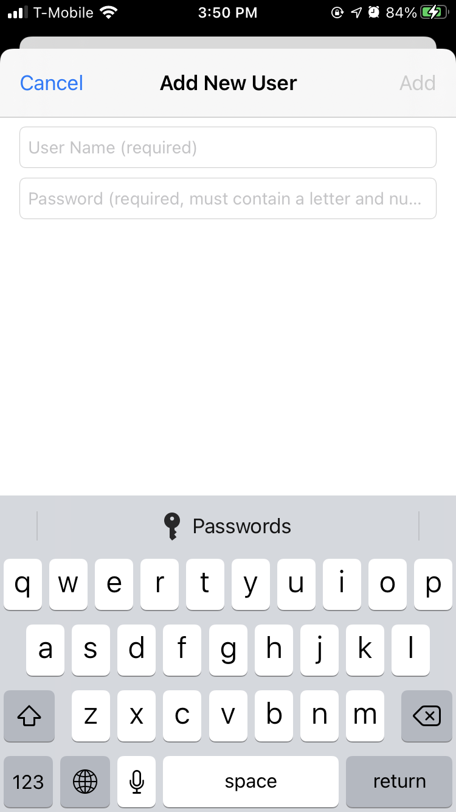

# XamarinChallenge 

This repository hosts an implementation of a Xamarin coding challenge.  The instructions of the challenge were to create a production-ready application consisting of a list of users and the ability to add a new user.  The challenge instructed to include specific string validation on a new user's password.

| Users Screen | Add New User |
|-|-|
| | |

## Technologies used

 MvvmCross was used to separate ViewModel logic from platform-specific View code and allow for future cross-platform sharing of ViewModel and Service code.  
 Xamarin.Essentials.Interfaces was used to support unit testing.
 Data was stored in the keychain / Secure Storage to simulate how secure information would be stored.

 ## UI/UX Considerations

 iOS UI was created using storyboards.  Text styles were used to support dynamically increasing font sizes for accessibility.  
 Text input validation was implemented using a hybrid approach.  The user was given some direction as to the validation rules through placeholder text.  The user is unable to submit the form when the input is invalid  by disabling the Add button.  If the input is invalid and the user presses the return key, they are shown a validation message explaining why the input is invalid.  The app is assumed to be en-US only and has not been localized. 
